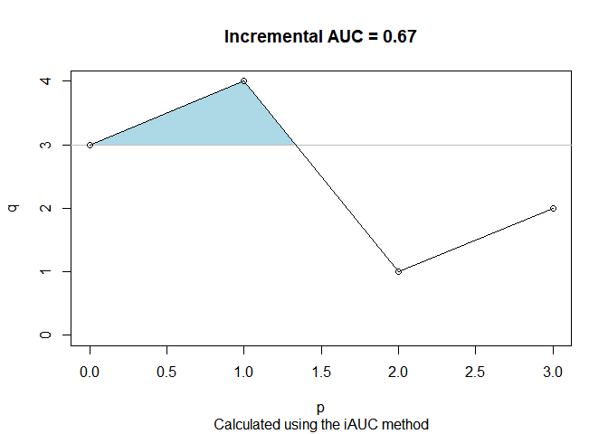

<!-- README.md is generated from README.Rmd. Please edit that file -->

# AUCtrap: AUC calculation using the trapezoidal rule

The goal of the `AUCtrap` package is to provide utilities for
calculating the area under the curve for longitudinal measurements.

## Installation

You can install the development version of AUCtrap from
[GitHub](https://github.com/) with:

``` r
# install.packages("devtools")
devtools::install_github("anikoszabo/AUCtrap")
```

## Example

This is a basic example which shows you how to solve a common problem:

``` r
library(AUCtrap)
AUCtrap(0:3, c(3,4,1,2))
#> 7.5 using method AUC
AUCtrap(0:3, c(3,4,1,2), method="iAUC")
#> 0.6666667 using method iAUC
AUCtrap(0:3, c(3,4,1,2), method="minAUC")
#> 4.5 using method minAUC
```

A formula can be used:

``` r
dd <- data.frame(Time = 0:4, Value = c(3,4,1,2,10))
AUCtrap(Value ~ Time, data=dd)
#> 13.5 using method AUC

ex2 <- AUCtrap(0:3, c(3,4,1,2), method="iAUC")
ex2
#> 0.6666667 using method iAUC
plot(ex2)

ex.min <- AUCtrap(0:3, c(3,4,1,2), method="minAUC")
plot(ex.min)
AUCtrap(Value ~ Time, data=dd, subset=Time < 4, method="minAUC")
```


